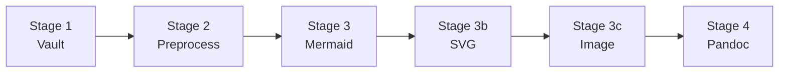

# Pipeline Architecture

obsidian-export converts Obsidian Markdown to PDF/DOCX through a 5-stage pipeline. Each stage is a pure function that transforms the document content.



## Stage 1: Vault Operations

Handles Obsidian-specific vault operations:

- **Frontmatter parsing** — extracts YAML frontmatter, cleans tags into keywords
- **Title extraction** — uses frontmatter `title` or falls back to filename stem
- **Embed resolution** — recursively resolves `![[embed]]` references with circular reference detection
- **Syntax stripping** — converts `[[wikilinks]]` to plain text, removes `## Relations` sections

**Module**: [`obsidian_export.pipeline.stage1_vault`](../reference/pipeline/stage1_vault.md)

## Stage 2: Text Preprocessing

Text-level transformations on the Markdown body:

- **Line ending normalization** — normalizes CRLF to LF and strips trailing whitespace per line
- **Variation selector stripping** — removes Unicode U+FE0F (emoji variation selector) that TeX cannot render
- **Dollar sign escaping** — `$25/user` renders as literal text, not LaTeX math
- **Callout conversion** — `> [!note]` blocks become colored boxes (PDF) or blockquotes (DOCX)
- **URL handling** — configurable strategies: keep, footnote long URLs, footnote all, or strip

**Module**: [`obsidian_export.pipeline.stage2_preprocess`](../reference/pipeline/stage2_preprocess.md)

## Stage 3: Mermaid Rendering

Renders `` ```mermaid `` code blocks to PNG images using mermaid-cli (mmdc):

- Extracts Mermaid blocks from the Markdown
- Invokes mmdc to render each block as a PNG
- Replaces the code block with an image reference

**Module**: [`obsidian_export.pipeline.stage3_mermaid`](../reference/pipeline/stage3_mermaid.md)

## Stage 3b: SVG Conversion

Converts SVG image references for format compatibility:

- Finds `` image references
- PDF output: converts each SVG to PDF via `rsvg-convert`
- DOCX output: converts each SVG to PNG via `rsvg-convert`
- Replaces SVG references with the converted file references

**Module**: [`obsidian_export.pipeline.stage3_svg`](../reference/pipeline/stage3_svg.md)

## Stage 3c: Image Conversion

Converts image formats not natively supported by the target renderer to PNG using Pillow:

- PDF (tectonic/LaTeX) natively supports: PNG, JPG/JPEG, PDF
- DOCX (pandoc) natively supports: PNG, JPG/JPEG, GIF, BMP, TIFF
- Any other format (e.g., WebP, AVIF) is converted to PNG in the temporary directory
- SVG images are skipped (handled by Stage 3b)

**Module**: [`obsidian_export.pipeline.stage3_image`](../reference/pipeline/stage3_image.md)

## Stage 4: Pandoc Conversion

Produces the final output via pandoc:

- **PDF**: Uses tectonic (XeLaTeX) as the PDF engine, with a rendered LaTeX header template for styling
- **DOCX**: Direct pandoc conversion with GFM input format

**Module**: [`obsidian_export.pipeline.stage4_pandoc`](../reference/pipeline/stage4_pandoc.md)

## Data Flow

Each stage receives the Markdown body as a string and returns a transformed string. The `run()` function orchestrates the stages in sequence:

```python
from obsidian_export import run
from obsidian_export.config import load_config

config = load_config(Path("my_config.yaml"))
run(Path("input.md"), Path("output.pdf"), "pdf", config)
```

The pipeline uses a temporary directory for intermediate files (Mermaid PNGs, SVG-to-PDF conversions). This directory is automatically cleaned up after conversion.
