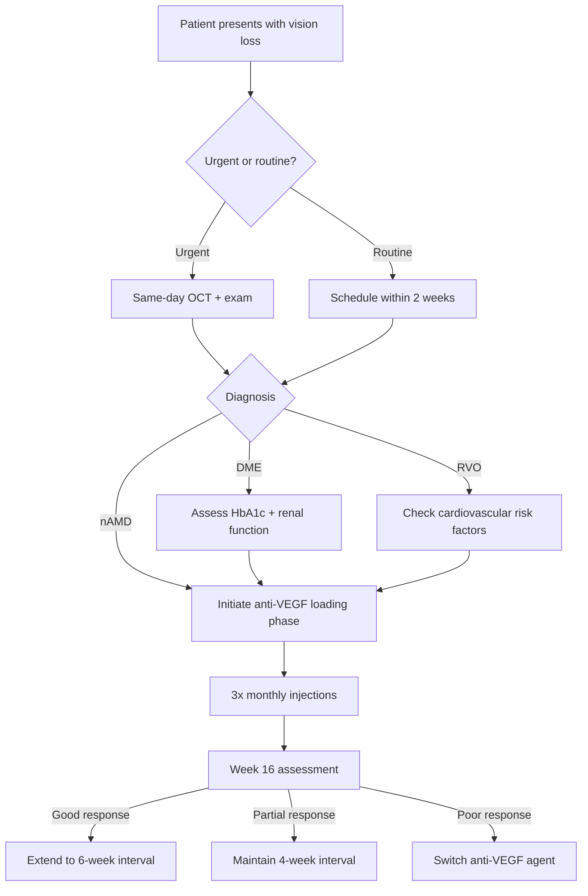
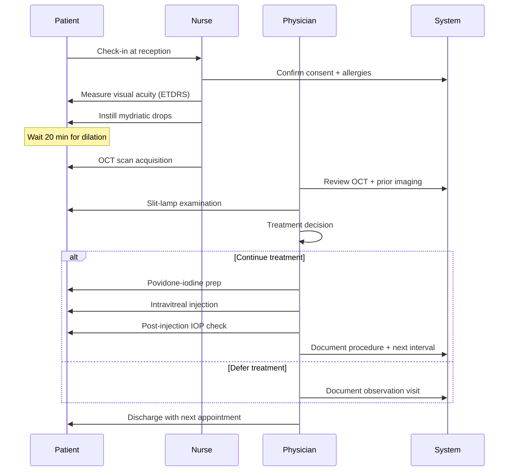
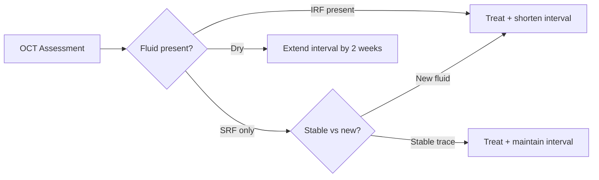

# Patient Pathway — Anti-VEGF Treatment

## Referral and Diagnosis Flow

```mermaid
flowchart TD
    A[Patient presents with vision loss] --> B{Urgent or routine?}
    B -->|Urgent| C[Same-day OCT + exam]
    B -->|Routine| D[Schedule within 2 weeks]
    C --> E{Diagnosis}
    D --> E
    E -->|nAMD| F[Initiate anti-VEGF loading phase]
    E -->|DME| G[Assess HbA1c + renal function]
    E -->|RVO| H[Check cardiovascular risk factors]
    G --> F
    H --> F
    F --> I[3x monthly injections]
    I --> J[Week 16 assessment]
    J -->|Good response| K[Extend to 6-week interval]
    J -->|Partial response| L[Maintain 4-week interval]
    J -->|Poor response| M[Switch anti-VEGF agent]
```

## Injection Visit Sequence

```mermaid
sequenceDiagram
    participant P as Patient
    participant N as Nurse
    participant D as Physician
    participant S as System

    P->>N: Check-in at reception
    N->>S: Confirm consent + allergies
    N->>P: Measure visual acuity (ETDRS)
    N->>P: Instill mydriatic drops
    Note over P: Wait 20 min for dilation
    N->>P: OCT scan acquisition
    D->>S: Review OCT + prior imaging
    D->>P: Slit-lamp examination
    D->>D: Treatment decision
    alt Continue treatment
        D->>P: Povidone-iodine prep
        D->>P: Intravitreal injection
        D->>P: Post-injection IOP check
        D->>S: Document procedure + next interval
    else Defer treatment
        D->>S: Document observation visit
    end
    D->>P: Discharge with next appointment
```

## Treatment Decision Criteria

```mermaid
flowchart LR
    A[OCT Assessment] --> B{Fluid present?}
    B -->|SRF only| C{Stable vs new?}
    B -->|IRF present| D[Treat + shorten interval]
    B -->|Dry| E[Extend interval by 2 weeks]
    C -->|New fluid| D
    C -->|Stable trace| F[Treat + maintain interval]
```
