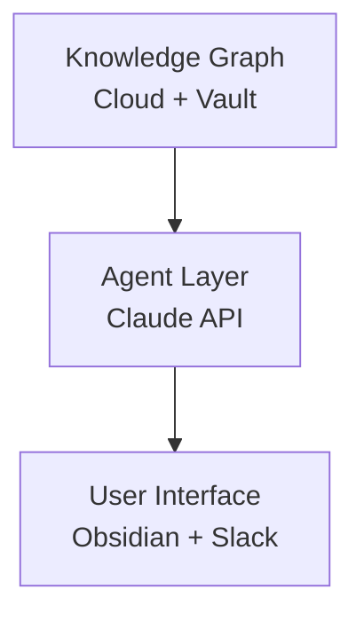

# Cloud Migration — Executive Summary

## Background

Acme Corp operates a distributed service network across ~300 locations. Engineers spend $25/user/month
on fragmented tooling. The proposed agentic system consolidates cloud data into a queryable
knowledge graph.

> [!NOTE] Scope
> This document covers Phase 1–3 of the cloud migration rollout. Phase 4 (ML inference) is tracked
> separately in the MLOps project.

## Architecture

The system is built on three components:

| Component | Technology | Cost |
|-----------|------------|------|
| Knowledge Graph | Cloud Search Service | ~$500/mo |
| Orchestration | Claude API (claude-sonnet-4-6) | ~$200/mo |
| Storage | Cloud Object Storage | ~$50/mo |

## Key Decisions

See [[cloud-migration/adr-001]] for the vendor selection decision.

> [!WARNING] Data Residency
> All data must remain in EU regions (Switzerland North or West Europe).
> Cloud-Prem options that require non-EU regions are not viable.

## URLs Example

Short link: https://example.com

Long link that should move to footnote: https://docs.example.com/en-us/cloud/search/what-is-cloud-search

## Special Characters

Revenue growth: 15% YoY (target: 20%)
Tilde example: ctrl~alt~delete pattern
Caret example: Power^2 notation

## Mermaid Diagram

## Relations

- relates_to [[goal-cloud-migration]]
- informed_by [[20260303_data_access_framework]]
