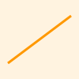
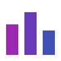

# Retinal Layer Segmentation Results

## OCT Layer Thickness Maps

The following figures show automated segmentation output from the SD-OCT analysis pipeline.

### RNFL Thickness

Mean RNFL thickness: 98.4 µm (within normal limits for age group).

### Ganglion Cell Layer

The GCL-IPL complex shows focal thinning in the inferior-temporal sector, consistent with early glaucomatous damage.

### Central Subfield Thickness

Central subfield thickness decreased from 412 µm at baseline to 278 µm at month 12, correlating with visual acuity improvement.

## Comparison Charts

Patients achieving a 16-week interval showed significantly better baseline characteristics (p < 0.01).
